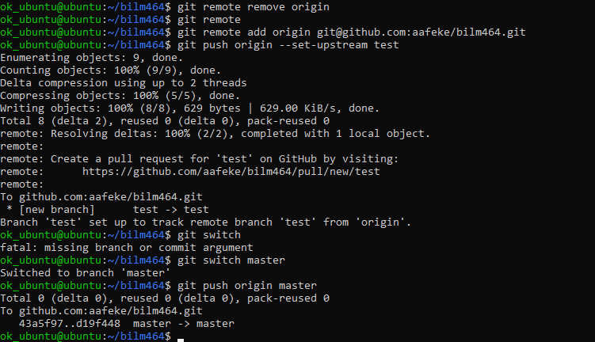

# Assignment 5: Proof

Setting up GitHub authentication for git in a virtual environment.

## Steps Taken:
```
sudo apt install git
git config --global --add user.name aafeke
git config --global --add user.email <email>
```

Branches are `master`and `test`.
 
## Screenshots

