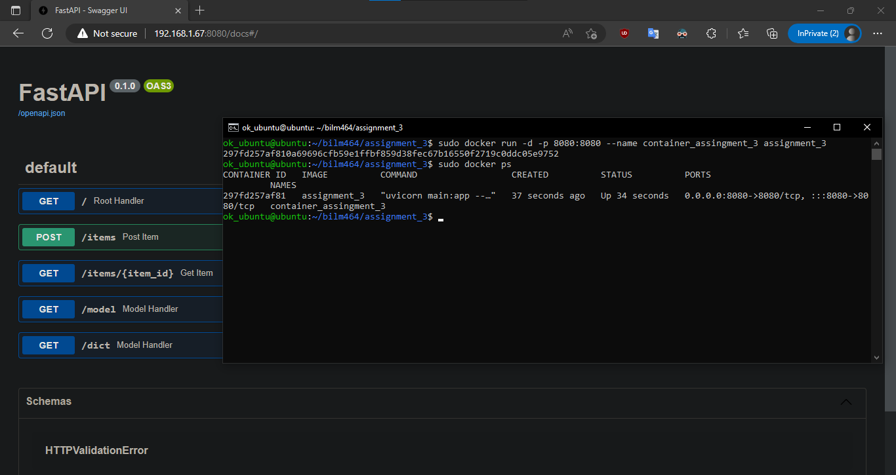

# Assignment 6: Docker Support
Running the service in container as a Docker image.
Dockerfile:
```Dockerfile
# syntax=docker/dockerfile:1
FROM python:3.10
WORKDIR /code
COPY ./requirements.txt /code/requirements.txt
RUN pip install --no-cache-dir --upgrade -r /code/requirements.txt
COPY ./main.py /code/
CMD ["uvicorn", "main:app", "--host", "0.0.0.0", "--port", "8080"]
```

## Screenshots:

